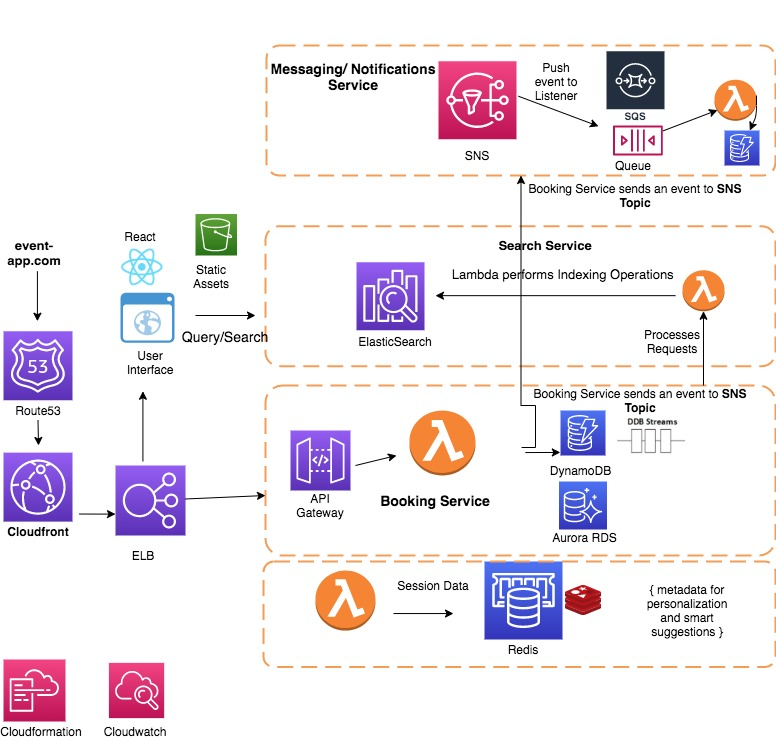

# aws-serverless-ticket-booking


Prototype of a Ticket Booking app for a fictional Event Booking Website Amazon Go

Author: Masoom Tulsiani

## Implementation




#### Lambda Functions


#### Function book_ticket
```book_ticket(user_id, ticket_id, seats)```


Response: 
```{
   "body": "{\"Succcess\": true, \"Message\": \"Booking Succcessfull\"}"
   }
```


#### Function get_tickets

```get_tickets()```


#### DynamoDB Structure
###### TICKETS_TABLE

```dynamodb
    ticketID : String
    ticketDate: String
    availableSeats: StringSet
    ticketStatus: String
}
```

###### BOOKED_TICKETS_TABLE

```dynamodb
    ticketID : String
    bookID: String
    seats: StringSet
    userID: String
}
```


Created using API Gateway
The functions are invoked from the browser using Amazon API Gateway.
To setup the api gateway, create the api, and then, create a resource (path) /tickets and /booking
##### /tickets (GET)
##### /booking (POST)

AWS SQS can also be used as pub sub for sending out notifications such as email confirmations for the booking


#### To-Do
Setup an AWS API Gateway with SQS integration, configure SQS's batch size to be consumed by lambdas with provisioned concurrency.
Send a message to SQS when reserving ticket, and another lambda to process the messages in the queue. This lambda will call the confirm booking or the cancel booking.
