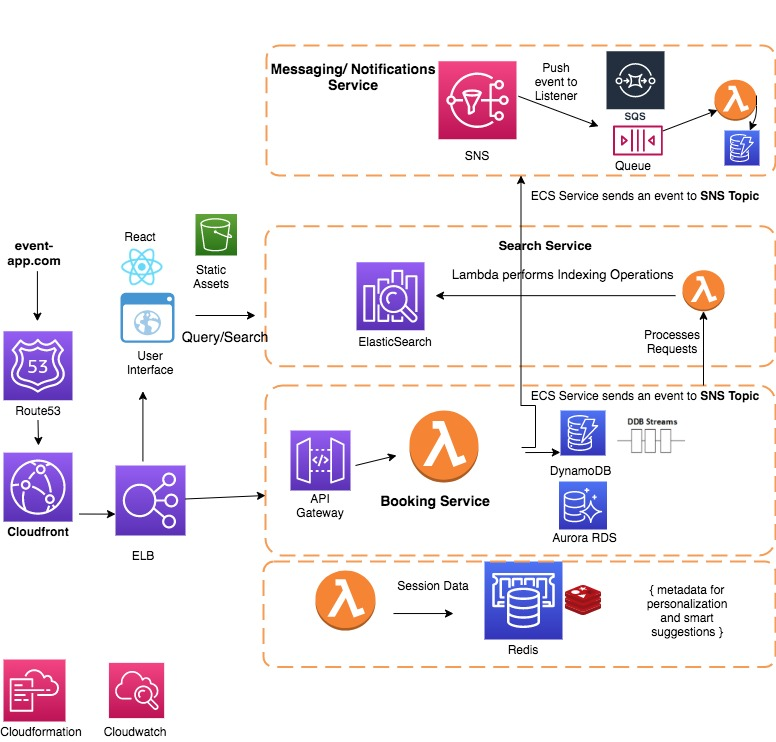
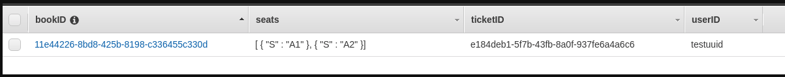

# aws-serverless-ticket-booking


Prototype of a Ticket Booking app for a fictional Event Booking Website Amazon Go

Author: Masoom Tulsiani

## Implementation




#### Lambda Functions


#### Function book_ticket
```book_ticket(user_id, ticket_id, seats)```


Response: 
```{
   "body": "{\"Succcess\": true, \"Message\": \"Booking Succcessfull\"}"
   }
```



#### Function get_tickets

```get_tickets()```


#### DynamoDB Structure
###### TICKETS_TABLE

```dynamodb
    ticketID : String
    ticketDate: String
    availableSeats: StringSet
    ticketStatus: String
}
```

###### BOOKED_TICKETS_TABLE

```dynamodb
    ticketID : String
    bookID: String
    seats: StringSet
    userID: String
}
```


Created using API Gateway
##### /tickets (GET)
##### /booking (POST)


##### To-DO

###### Messaging 
######  Loyalty
